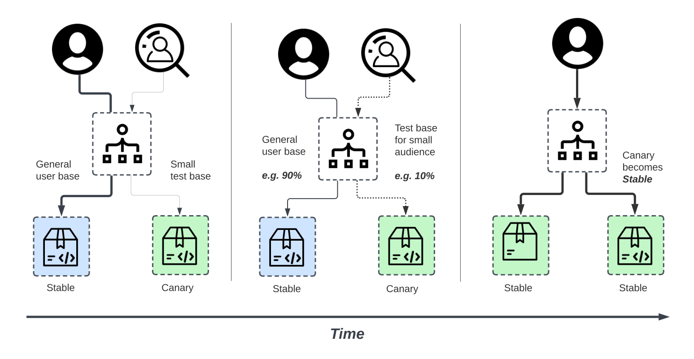
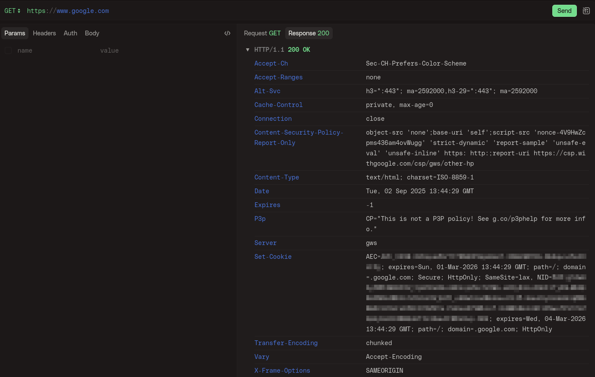
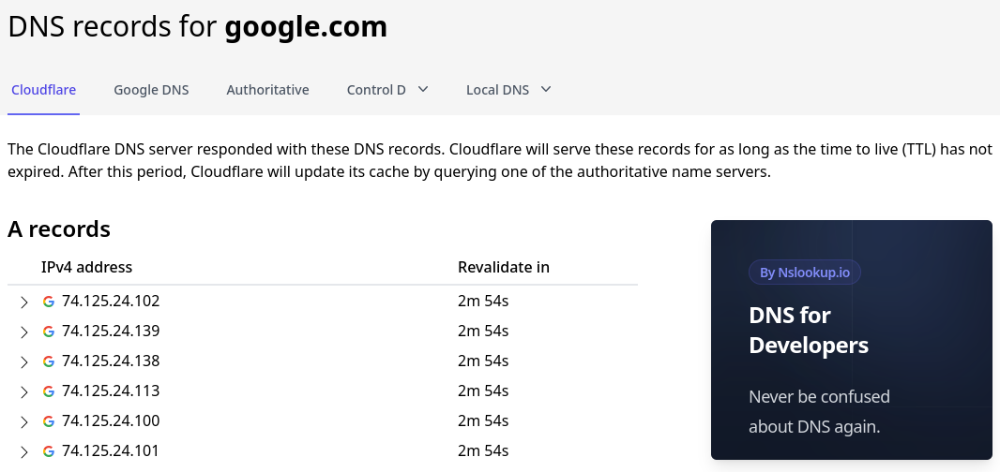
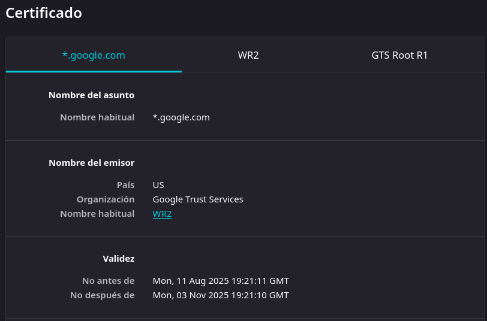
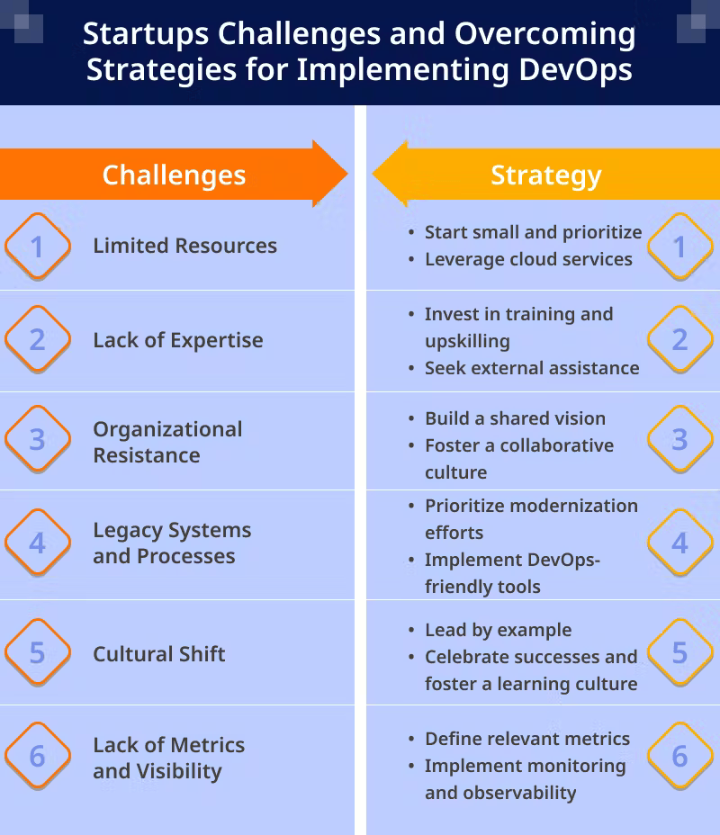

# Actividad 1-CC3S2

## Información

- Nombre: Diego Akira García Rojas
- Fecha de presentación: 03-09-25
- Tiempo invertido: 03:20
- Entorno:
  - Editor de texto: Doom Emacs
  - Cliente Git: Magit
  - Desarrollo de diagramas: draw.io
  - Sistema operativo: Fedora Linux 42

## Desarrollo

### DevOps vs. Cascada tradicional

- ¿Por qué DevOps acelera y reduce riesgo en software para la nube frente a cascada?
  - La nube se beneficia enormemente de la automatización al poder adaptarse a la infraestructura necesaria con cada iteración con pequeños cambios, lo cual tomaría demasiado tiempo en una metodología de cascada. Además, el riesgo en software se reduce al poder tener feedback constante tanto de uso por parte de los usuarios como por resultados de pruebas integradas con cada despliegue.

- ¿En qué contexto real se puede usar un enfoque cercano a cascada?
  - Los proyectos en los que es poco probable que se tengan cambios constantes o en los que se tenga alta regulación y control, como software cercano al hardware en dispositivos embebidos o dispositivos médicos. Estos últimos particularmente requieren un cumplimiento de requisitos y estándares rigurosos para los que DevOps no encajaría adecuadamente.
  - Criterios verificables
    - Cumplimiento normativo: En software utilizado en el área de salud, se realiza un seguimiento constante del desarrollo para que cumpla con estándares.
    - Control de calidad: Se espera que se cumpla con un estándar de calidad para lo que el enfoque de cascada sería más útil frente al cambiante de Devops.
  - Trade-offs
    - El enfoque de cascada ofrece más seguridad al tener pasos más rigurosos y definidos al sacrificar velocidad y cambios rápidos.
    - El enfoque de cascada asegura un estándar de calidad final luego de pasar por todos las etapas necesarias a cambio de un software difícil de actualizar una vez terminado.

---

### Ciclo tradicional de dos pasos y silos

- Identifica dos limitaciones del ciclo de construcción y operación sin integración continua.
  - **Grandes lotes de trabajo**: La separación en fases de construcción y operación hace que el código se integre con poca frecuencia y, en caso se encuentren errores, estos se tengan que solucionar regresando a la fase de construcción. Esto aumenta el tiempo de desarrollo en total.
  - **Colas de defectos**: Al tener un bajo ritmo de integración, los defectos no se detectan hasta el paso de operación, para los cuales se pueden haber acumulado varios.

- Define dos anti-patrones y explica cómo agravan incidentes.
  - **Spaghetti code**: Cuando el código se vuelve difícil de leer, poco modular, poco estructurado y de alta complejidad. Esto resulta en código difícil de mantener y en errores más difíciles de corregir a la larga.
  - **Throw over the wall**: Dejar el trabajo a otro equipo o a etapas tardías esperando que alguien más lo haga. Esto reduce la colaboración entre equipos y en caso de un incidente puede aumentar el MTTR, ya que un equipo que no desarrolló el código puede encontrarse con partes difíciles de comprender.

---

### Principios y beneficios de DevOps

- Decribe CI y CD destacando tamaño de cambios, pruebas automatizadas cercanas al código y colaboración.
  - **Tamaño de cambios**: Se integran cambios pequeños de forma continua, idealmente varias veces al día.
  - **Pruebas automatizadas**: Las pruebas se desarrollan de la mano con el código. Cada nueva funcionalidad debe desarrollarse con un conjunto de pruebas que las asegure en futuras iteraciones.
  - **Colaboración**: Los cambios constantes hacen que los desarrolladores trabajen en conjunto en todo momento, tomando en cuenta siempre los cambios de los otros y probándolos con un conjunto de tests.

- Explica cómo una práctica Agile alimenta decisiones del pipeline.
  - **Reuniones diarias**: Las reuniones diarias fomentan discusiones del código, en particular en la forma en la que está evolucionando y en los errores encontrados. Si una funcionalidad se considera completa, esta puede ser llevada a entornos de producción. En cambio, si se encuentran errores o bloqueos, esto puede modificar el rumbo del pipeline para enfocarse en estos problemas.

- Propón un indicador observable para medir mejoras de colaboración Dev-Ops.
  - **Tiempo de PR hasta despliegue (lead time)**: Este tiempo representa qué tan bien se integran nuevos cambios a la base de código. Menor tiempo representa mayor tasa de errores encontrados y solucionados rápidamente y una mayor tasa de despliegue.
    - Para recolectar esta métrica, se pueden desarrollar herramientas locales (*in-house*) o scripts para medir los tiempos.

---

### Evolución a DevSecOps

- Diferencia **SAST** y **DAST** y ubícalos en el pipeline
  - SAST y DAST son un conjunto de herramientas que permiten el análisis de código en diferentes momentos para detectar vulnerabilidades.
    - SAST se enfoca en el código *estático* o sin ejecutarse para hacer una revisión *white-box*, con toda la información presente en el código. Este tipo de análisis se realiza en las fases tempranas del código, idealmente antes o después de hacer commit.
    - DAST se enfoca en el código de forma *dinámica*. Es decir, realiza análisis de seguridad mientras la alicación está siengo ejecutada, tomando un enfoque similar a un atacante al buscar vulnerabilidades al estilo *black-box*, sin conocimiento del código detrás de la aplicación. Este tipo de análisis se realiza en las últimas fases del pipeline, en una rama especial para el análisis o hasta en producción.

- Los *gates* de seguridad o *security gates* son puntos en el ciclo de desarrollo en donde el código debe cumplir con ciertos estándares de seguridad antes de pasar a las siguientes fases. Algunos umbrales medibles pueden ser:
  - **Bloqueo por seguridad crítica**: Si alguna herramienta de análisis detecta una vulnerabilidad crítica en el código, este es bloqueado y no se permite su pase a las siguientes fases antes de que este error sea corregido.
  - **Cobertura**: El código puede ser bloqueado si se detecta que las pruebas no cubren más de, por ejemplo, el 70% del código.
  
-  ¿Cómo evitar el "teatro de seguridad"? Propón **dos señales de eficiencia** y **cómo** medirlas.
  - El teatro de la seguridad se debe evitar, en primer lugar, reconociendo cualquier medida ineficiente de seguridad que de una sensación de protección por encima de realmente proteger un sistema. Una vez reconocido, se debe reemplazar con medidas de seguridad genuinas.
  - Dos posibles señales de eficacia de las medidas de seguridad son:
    - **Disminución de hallazgos repetidos**: Comparar el número de vulnerabilidades repetidas encontradas en escaneos de vulnerabilidad. Mientras menos se repitan, mayor énfasis en la seguridad se tiene en la organización.
    - **Mean Time To Repair**: Es el tiempo que toma corregir un error de seguridad. Esta medida representará la importancia de corregir errores detectados en una organización.
    
---

### CI/CD y estrategias de despliegue

- Inserta una imagen del pipeline o canary.

- Elige **una estrategia** para un microservicio crítico y justifica.
  - Una opción viable sería el despliegue *blue-green*, en el que se transfiere poco a poco el tráfico de usuarios de un servicio estable a uno nuevo, ambos en producción. Esto se debe porque así se verifica que el microservicio cumple con las expectativas de funcionamiento con un grupo de usuarios reducidos. Una vez que se cumplan estas expectativas, se pueden aumentar el número de usuarios.
- Crea una tabla breve de riesgos vs. mitigaciones.

| **Riesgo**                                            | **Mitigación**                                                                                                                    |
| ----------------------------------------------------- | --------------------------------------------------------------------------------------------------------------------------------- |
| **Regresión funcional en endpoints de login/refresh** | Validación de **contratos automatizada** (contract tests) y **canary con métricas SLO** antes de promover.                        |
| **Costo operativo del doble despliegue (Blue-Green)** | Definir **límites de convivencia temporales** (ej. mantener Blue activo solo 24–48h) y apagar entorno previo tras estabilización. |
| **Manejo de sesiones/estado compartido**              | Usar **stores centralizados** (Redis) + “**draining**” de sesiones antiguas + compatibilidad de esquemas durante transición.      |

- Si el KPI técnico se mantiene, pero cae una métrica de producto (conversión), explica por qué ambos tipos de métricas deben coexistir en el gate.
  - Dejar que una métrica caiga y solo fijarse en una de estas puede indicar que ocurre un error en el flujo de negocio causado por algún cambio técnico.
  - Un gate que tome en cuenta ambos aspectos, el técnico y el de producto, asegura que el servicio funciona bien técnicamente y que provee un impacto positivo en los usuarios.

---

### Fundamentos prácticos sin comandos

#### **HTTP - Contrato observable**

  
  
  - Método: GET
  - Código de estado: 200 OK
  - Cabeceras: 
    - Cache-control: private, max-age=0
    - X-Frame-Options: SAMEORIGIN
  - Importancia
    - El cache-control controla cómo clientes y proxies guardan la respuesta, lo cual afecta el rendimiento.
    - X-Frame-Options muestra opciones de seguridad, importante para la observabilidad durante incidentes.

#### **DNS - nombres y TTL**

  
  
  - Tipos de registro: A
  - TTL: 2m 54s
  - El TTL afecta los rollbacks en el tiempo de propagación de cambios. Mayor TTL implicaría que los cambios demorarían en llegar a una mayor cantidad de usuarios, mientras que menor TTL es más eficiente para rollbacks frecuentes.

#### **TLS - seguridad en tránsito**

  

  - Vigencia: no antes de 11/08/25 hasta no después de 03/09/25
  - Emisora: Google Trust Services
  - Si no se puede validar el certificado, el navegador mostrará errores de certificados advirtiendo del riesgo que supone interacturas con la página web.

#### **12-Factor - port binding, configuración, logs**
  
  - Para parametrizar el puerto sin tocar el código, esta debe ser enviada como una variable de entorno, la cual es leída en arranque.
  - Los logs deben ser vistos en la sálida estándar del programa. Escribir los logs manualmente implica el riesgo de errores humanos o de fragmentaciones entre máquinas.
  - Escribir credenciales directamente en el código implica un grave riesgo de filtración de estas mismas. La reproducibilidad también se ve afectada al tener las credenciales explícitas en el código, ya que quizá se necesiten otras credenciales en otras ramas y se tenga que modificar y recompilar.

#### **Checklist de diagnóstico (incidente simulado)**

  1. Verificar contrato HTTP
  2. Revisar cabeceras HTTP
  3. Comprobar resolución DNS 
  4. Inspeccionar certificado TLS
  5. Verificar puertos en escucha
  6. Correlacionar con logs de aplicación

---

### Desafíos DevOps y mitigaciones

  
 
| **Riesgo**                                                    | **Mitigación concreta**                                                                                                                              |
| ------------------------------------------------------------- | ---------------------------------------------------------------------------------------------------------------------------------------------------- |
| **Fallo crítico en producción tras un cambio**                | **Rollback inmediato**: mantener versión anterior para revertir en segundos si el nuevo release falla.            |
| **Impacto masivo por bug no detectado**                       | **Despliegues graduales (Canary/Rollout progresivo)**: liberar a un 1–5% de usuarios primero y monitorear SLOs antes de extender a todos.            |
| **Errores humanos en código o configuración sensible**        | **Revisión cruzada (peer review + pruebas automatizadas)**: exigir al menos un reviewer y validaciones de CI antes de permitir la promoción.         |
| **Incidente que afecta a todos los usuarios al mismo tiempo** | **Límites de blast radius**: segmentar el despliegue por región o cluster; usar *feature flags* para habilitar solo en subconjuntos controlados. |

